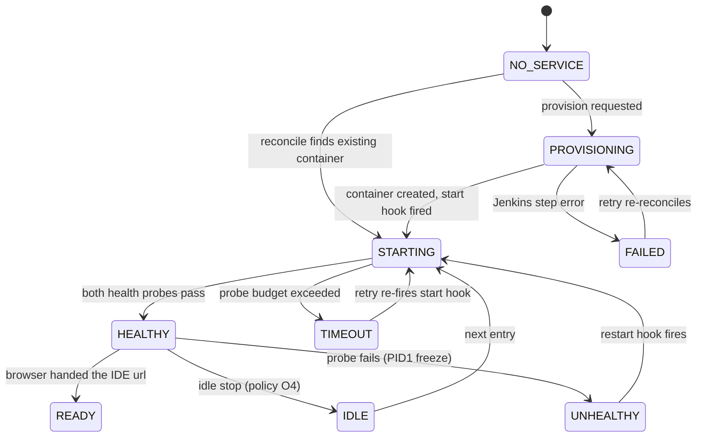
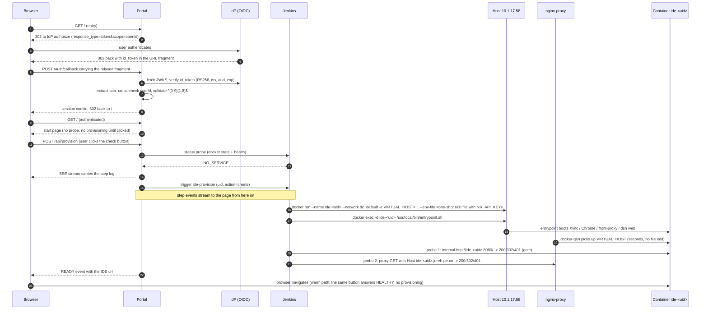

# Per-user IDE service on demand: requirements

English | [中文](0007-per-user-ide-requirements.zh.md)

Status: draft for review. The Open items section lists every decision still waiting on the requester. The companion [0008](0008-per-user-ide-design.md) carries the design against these requirements.

## Purpose and scope

Employees reach a personal DSH Web IDE through one stable entry URL. After enterprise OIDC login, the entry resolves the user's identity to a per-user domain `ide-<uid>.jereh-pe.cn` and checks that user's service — on arrival in auto entry mode, on the user's click on the start page in manual mode — starts the container when it is missing, shows the start-up and check progress as live log lines in the browser, and finally hands the browser to the user's own IDE.

In scope: identity-to-domain resolution, on-demand container provisioning, health verification, live progress reporting, the redirect. Out of scope: the IDE product itself, image building (owned by the Jenkins pipeline in [docs/ops/2026-09-05-airgapped-dsh-aio-jenkins-build.md](../ops/2026-09-05-airgapped-dsh-aio-jenkins-build.md)), and per-user data backup.

## Actors and environment

| Actor | Description |
|---|---|
| Browser | The employee's browser, starting at the shared entry URL. |
| Portal | The Web entry application: OIDC login, state machine, live log stream, redirect. |
| IdP | The enterprise OIDC identity provider; issues `id_token`s verifiable against its JWKS. |
| Jenkins | `new-jenkins.jereh.cn`; the only component allowed to act on the Docker host. |
| Host 10.1.17.58 | CentOS 7, docker 20.10.8 (no compose v2), `*.jereh-pe.cn` wildcard resolves here. |
| nginx-proxy | `jr-nginx-proxy` (1.3.0) on compose network `dc_default`; routes by `VIRTUAL_HOST` labels. |
| User container | One `dsh-aio` container per user, vhost `ide-<uid>.jereh-pe.cn`, front-proxy on port 8080. |

## Identity claims

The IdP is the Jereh IAM (C10). One verified `id_token` from the production login carries exactly these claims, which fixes what the flow may depend on:

| Claim | Value | Use here |
|---|---|---|
| `sub` | `"14409"` | The uid. Employee number, matches `^[0-9]{1,8}$`. |
| `userId` | `"14409"` | Cross-check against `sub`; a mismatch refuses the session. |
| `uid` | `"20241029082727096-E823-55B596A1D"` | Never used. Despite the name it is a session identifier, not a user number, and is not numeric. |
| `iss` | `https://iam.jereh.cn/idp` | Enforced equal to the discovery document's issuer. |
| `aud` | `EnterpriseDingtalk` | Enforced equal to the configured client id. |
| `iat` / `auth_time` / `exp` | `auth_time == iat`, `exp = iat + 24h` | Session lifetime; no refresh token is used. |
| `nonce` / `jti` | `nonce: null` | Not used; replay protection rides the state cookie. |

The token carries **no email and no group claim**. Any entry restriction to a subset of employees must therefore come from a portal-maintained list of employee numbers, not from the token (O1).

## Functional requirements

- **FR1 Identity**: the portal authenticates with the IdP over the implicit flow that the Jereh IAM speaks (C10): the browser relays the `id_token` out of the redirect fragment, and the portal verifies signature, `iss`, `aud`, and `exp` against the published JWKS before reading any claim. The uid comes from the verified `sub` claim, cross-checked against `userId` — never from a user-editable field (O1).
- **FR2 Domain derivation**: from the verified uid, the portal derives exactly `ide-<uid>.jereh-pe.cn` and the container name `ide-<uid>`. The uid must match `^[0-9]{1,8}$` before any name, domain, volume, or command is built from it (see SR1).
- **FR3 Warm path**: when a service check answers healthy — triggered by arrival in auto entry mode, or by the start page's check button in manual mode — the portal hands the browser the user's IDE url. No provisioning runs.
- **FR4 Cold path**: when the check finds no container, the portal provisions it end to end from that same check: create the container with `docker run` (executed through Jenkins, per the requester's decision), start it, verify health, then hand the browser the user's IDE URL. Entry mode is the portal config `autoCheck` ([0008 Configuration](0008-per-user-ide-design.md)): `true` reconciles on arrival and reaches Docker without a click (the original entry flow); `false` renders the start page and an entry that is never clicked creates no Jenkins build and touches no Docker state. The shipped deployment runs `autoCheck: false`; reverting to auto is a config change, not a code change (requester decision, 2026-09-06: keep both paths, run manual until it proves out).
- **FR5 Live progress**: every check and provisioning step — probe results, Jenkins acceptance, container start, image pull, health attempts, failures — appears in the browser as a timestamped log line within seconds of happening, on the portal page the user already has open.
- **FR6 Crash-safe re-entry**: after a host reboot or a half-started container, a new entry detects the real Docker state (reconcile) and takes the shortest path back to healthy, including re-firing the start hook on 10.1.17.58's PID1 freeze (C2).
- **FR7 One provisioning per user**: two tabs or devices entering at once must produce exactly one provisioning action; the second viewer subscribes to the same live log.
- **FR8 Failure reporting**: a failed step stops the flow, names the failed step and its error in the log panel, and offers a retry that resumes from the reconciled state.
- **FR9 Data survives recreation**: user workspaces live on a named volume; recreating or upgrading a container never destroys user data.
- **FR10 Model key injection**: the platform LLM key lives in the Jenkins Secret text credential `ide-model-key` in the global credentials store; the create-stage build binds it and injects it as `NR_API_KEY` into the new container's environment, so the agent can call the LLM from first boot. The portal holds and sends no key. Restarts and probes never need it — it is part of the container's stored configuration.

## User stories

| # | Story | Acceptance |
|---|---|---|
| US1 | As a first-time user, after login I watch my IDE being built and land in it. | Step-level log from creation to health; redirect only after both health probes pass; cold path ≤ 5 min typical (image pre-pulled). |
| US2 | As a returning user, login gets me into my IDE — automatically in auto mode, with one click in manual mode. | auto mode: single 302, no intermediate page. manual mode: the start page renders immediately, the check button's probe answers HEALTHY and the page navigates; no provisioning runs. |
| US3 | As a user after a host reboot, entering again just works. | Stopped or frozen container is detected, started with the hook, health-checked, redirected; the page says "recovering", not "error". |
| US4 | As a user with two tabs, I never get two provisioning runs. | One Jenkins job per user at a time; second tab streams the same events. |
| US5 | As a user whose provisioning failed, I see where and why. | Failed step highlighted with its error and the Jenkins console link; one-click retry re-reconciles first. |
| US6 | As an operator, idle containers stop to free the host. | Parked with O4: idle reclamation does not run in the first version; every container stays until stopped by hand. |
| US7 | As an out-of-scope employee, I cannot get a container. | A verified identity outside the allowed set gets a clear refusal and no resources are created. |
| US8 | As an admin, I can list user services and force-stop one. | (deferred; first version is direct `docker` access on the host) |

## State machine

Server-side state is authoritative; the page is a projection of it, so any entry — fresh, retried, or from a second tab — renders the same current state.

## Sequence: cold start

The warm path ends at the status probe: it answers HEALTHY and the browser receives the IDE url; none of the provisioning tail runs. In auto entry mode the arrival triggers the probe and the answer lands as a `302` from `GET /`; in manual mode (the shipped default) the check button triggers it and the page navigates. The sequence below shows manual mode; in auto mode the probe fires on arrival instead of on the click.

## Environment constraints (verified, not assumed)

| # | Constraint | Source |
|---|---|---|
| C1 | `dsh web` refuses any non-loopback bind by design; every user container must run `front-proxy` with `FRONT_PORT=8080` as its only routable port. | [0005](0005-reverse-proxy-exposure.md) |
| C2 | On 10.1.17.58 (CentOS 7, docker 20.10.8/runc) a plain detached start freezes PID1 mid-boot; the supported launch is two-step: start with a sleep entrypoint, then `docker exec -d` the real entrypoint. The start step must always include the hook. | [ops 2026-09-05](../ops/2026-09-05-airgapped-dsh-aio-jenkins-build.md) |
| C3 | Deployed nginx-proxy is 1.3.0: only plain `VIRTUAL_HOST`/`VIRTUAL_PORT` are honored; `VIRTUAL_HOST_MULTIPORTS` is silently ignored. | [0005](0005-reverse-proxy-exposure.md) |
| C4 | The proxy serves HTTP only; no certificate is installed. | [ops 2026-09-05](../ops/2026-09-05-airgapped-dsh-aio-jenkins-build.md) |
| C5 | Host runs docker 20.10.8 and docker-compose v1; compose v2 is absent. User containers therefore bypass compose entirely (`docker run`), and the proxy's own `/home/admin/git/dc/docker-compose.yml` is never edited — `dc_default` is an attachable external network. | [0005](0005-reverse-proxy-exposure.md) |
| C6 | Harbor `harbor.jereh.cn/base/dsh-aio:dev-amd64[-<sha>]` exists on-host; the image is ~4.12 GB and the host has ~80 GB free, so concurrent user count is disk-bound. | [ops 2026-09-05](../ops/2026-09-05-airgapped-dsh-aio-jenkins-build.md) |
| C7 | Web answers at ~45 s once the entrypoint actually runs; the first Vite watch pass can add minutes. Health budgets must assume minutes, not seconds. | [ops 2026-09-05](../ops/2026-09-05-airgapped-dsh-aio-jenkins-build.md) |
| C8 | The `/api` browser-trust fence rejects a rewritten `Host`; every user container needs `TRUSTED_HOSTS=ide-<uid>.jereh-pe.cn`. | [0005](0005-reverse-proxy-exposure.md) |
| C9 | Jenkins reaches the host as `admin` over the `ssh` credential and is already the repository-driven build path (`Jenkinsfile`, Pipeline from SCM). | [ops 2026-09-05](../ops/2026-09-05-airgapped-dsh-aio-jenkins-build.md) |
| C10 | The IdP is the Jereh IAM (`https://iam.jereh.cn/idp`, test `iam-test.jereh.cn`): implicit flow (`response_type=token`), token delivered in the URL fragment, RS256 keys at `/idp/oidc/getPublicKey` behind `/.well-known/openid-configuration` (top-level layout also tolerated), 24-hour tokens, `state` echoed as the literal string `null`. The shipped gate [`packages/host/auth-iam`](../../packages/host/auth-iam/README.md) already implements this integration. The IAM does not match `redirect_uri` against a client registration: an authorize request carrying the unregistered `http://ide.jereh-pe.cn/auth/callback` was accepted with the same 302-to-login as the registered dingtalk callback (verified 2026-09-05, per the requester: no IAM-administrator coordination is needed). Deployments compose their own `redirect_uri`. | [auth-iam](../../packages/host/auth-iam/README.md), [decision note](../../.agents/notes/implemented/feature/2026-09-05-jereh-iam-oidc-integration.md) |

## Security requirements

- **SR1 Injection fence**: the uid is the only user-derived value entering container names, domains, volume names, and remote commands. Only the strict numeric pattern passes; anything else is a hard refusal, never sanitized-and-continued. The `uid` claim must never be used for this: it is a non-numeric session id that resembles neither the pattern nor the employee number.
- **SR2 Reachability**: `ide-<uid>.jereh-pe.cn` is enumerable (uid = employee number) and C4 means plain HTTP. Unauthenticated reach of a user container is remote code execution. The portal must require its session cookie on every route, and the user container's own auth story is Open item O2 with a container-side OIDC gate recommended.
- **SR3 Execution authority**: only Jenkins holds the host credential; the portal holds a Jenkins trigger token, never the SSH credential.
- **SR4 Token handling**: the OIDC `id_token` stays server-side at the portal; it is never placed in a URL query or in a provisioned container's environment. Handing it to user containers (the gate's cookie model does exactly that) is decided with O2, not by implementation drift.
- **SR5 Model key exposure surface**: the injected key is readable by anyone who can `docker exec` into a user container (that is, the container's own user) or `docker inspect` on the host. That is accepted, so the key must be a revocable platform key with spend limits, and it must never travel as a plain console line, a command-line argument visible in the host's process list, or a build parameter (Jenkins persists parameters into build records); the key's home is the Jenkins Secret text credential and the transport rules are in [0008](0008-per-user-ide-design.md) (O3 resolved with them).

## Non-functional requirements

- **N1**: cold path (create → ready) completes within 5 minutes typical, hard timeout configurable (default 10 minutes).
- **N2**: a step event reaches the browser within 2 seconds of the portal or Jenkins emitting it.
- **N3**: no per-user state is stored in the portal database; Docker on the host plus a small marker file are the only truth, so the portal can be restarted or replaced at any time.
- **N4**: one portal instance may serve the whole uid range from the single host; multi-host routing is a non-goal for this version (O6).

## Open items

O4, O5, and O7 are deliberately parked by the requester (2026-09-05): the main flow (US1–US5) ships first, and nothing in [0008](0008-per-user-ide-design.md) depends on them.

| # | Decision | Recommendation on record |
|---|---|---|
| O1 | ~~Which claim carries the uid~~ — resolved: `sub` (= `userId`), see Identity claims. Remaining half: the entry allowlist — parked with the same decision as O4/O5/O7; the first version admits every identity the company SSO admits. | Add the portal-side employee-number list only when a real exclusion is needed. |
| O2 | Whether the user container itself requires login. | Yes — mount the shipped OIDC gate in the container; silent re-auth via the IAM `usk` session after the redirect. No registration cost: each container composes `redirect_uri=http://ide-<uid>.jereh-pe.cn/auth/callback` and the IAM accepts unregistered callbacks (C10). |
| O3 | ~~Whose model API key~~ — resolved (requester): one platform key, single home in the Jenkins Secret text credential `ide-model-key`, bound by the create-stage build and injected into every container (FR10). Remaining: confirm the key is revocable and spend-capped (SR5). | Issue a dedicated platform key for this fleet, not a personal one. |
| O4 | Idle reclamation: threshold, stop-vs-remove, who schedules it. | **Open, parked**: revisit after the main flow runs. Then: stop (keep volume) after N hours of no session activity. |
| O5 | TLS on `*.jereh-pe.cn` (wildcard cert via DNS-01). | **Open, parked**: revisit after the main flow runs; strongly recommended once the fleet grows. |
| O6 | Multi-host scaling. | Out of scope; keep the host in portal config so a later host map is additive. |
| O7 | Concurrent-user cap and per-container resource limits. | **Open, parked**: revisit after the main flow runs. Then: cap by disk (~15 running containers at 4.12 GB against 80 GB); CPU/RAM limits TBD. |

## Related

- [0008](0008-per-user-ide-design.md) — the design implementing these requirements.
- [0005](0005-reverse-proxy-exposure.md) — front-proxy, trust fence, and the proxy recipe every user container reuses.
- [docs/ops/2026-09-05-airgapped-dsh-aio-jenkins-build.md](../ops/2026-09-05-airgapped-dsh-aio-jenkins-build.md) — host facts, Jenkins access, PID1 freeze, harbor images.
