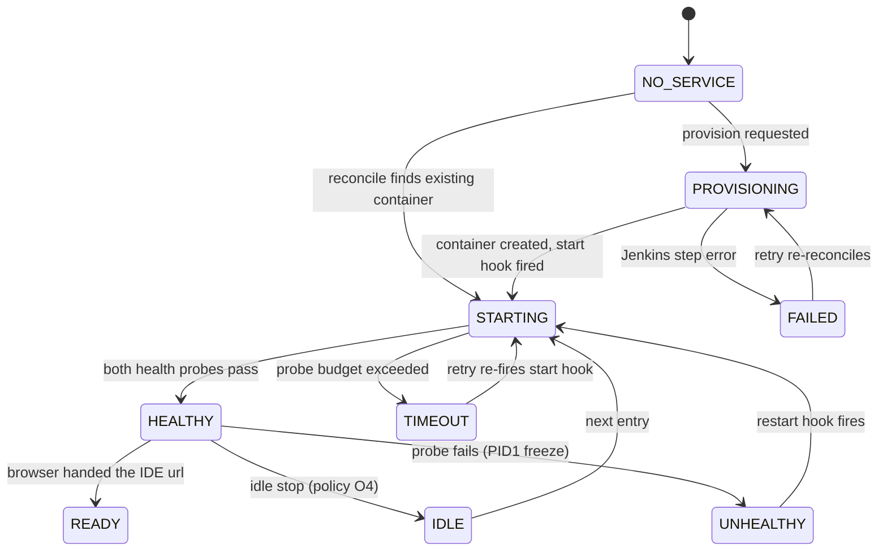
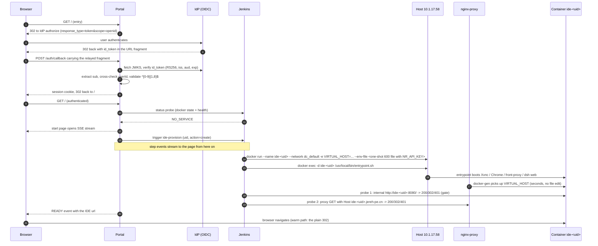

# 按需开通每用户 IDE 服务:需求

[English](0007-per-user-ide-requirements.md) | 中文

状态:评审用草稿。未决事项一节列出了全部仍在等待需求方拍板的决策。配套设计见 [0008](0008-per-user-ide-design.zh.md)。

## 目的与范围

员工通过一个固定的入口 URL 访问个人 DSH Web IDE。企业 OIDC 登录完成后,入口把用户身份解析为每用户域名 `ide-<uid>.jereh-pe.cn`,若该用户的容器尚未运行则将其启动,并把启动与检查过程作为实时日志逐行显示在浏览器页面上,最终把浏览器临时重定向到该用户自己的 IDE。

范围内:身份到域名的解析、按需容器开通、健康验证、实时进度上报、重定向。范围外:IDE 产品本身、镜像构建(归 [docs/ops/2026-09-05-airgapped-dsh-aio-jenkins-build.zh.md](../ops/2026-09-05-airgapped-dsh-aio-jenkins-build.zh.md) 的 Jenkins 流水线所有)、每用户数据备份。

## 参与者与环境

| 参与者 | 说明 |
|---|---|
| 浏览器 | 员工的浏览器,从共享入口 URL 进入。 |
| Portal | Web 入口应用:OIDC 登录、状态机、实时日志流、重定向。 |
| IdP | 企业 OIDC 身份提供方;签发的 `id_token` 可用其 JWKS 验签。 |
| Jenkins | `new-jenkins.jereh.cn`;唯一被允许对 Docker 宿主机执行操作的组件。 |
| 宿主机 10.1.17.58 | CentOS 7、docker 20.10.8(无 compose v2);`*.jereh-pe.cn` 泛解析指向此机。 |
| nginx-proxy | `jr-nginx-proxy`(1.3.0),位于 compose 网络 `dc_default`;按 `VIRTUAL_HOST` label 路由。 |
| 用户容器 | 每用户一个 `dsh-aio` 容器,vhost 为 `ide-<uid>.jereh-pe.cn`,front-proxy 监听 8080 端口。 |

## 身份 claim

IdP 是 Jereh IAM(C10)。生产登录返回的一个已验签 `id_token` 恰好携带这些 claim,由此锁定本流程可以依赖什么:

| Claim | 取值 | 在本文中的用途 |
|---|---|---|
| `sub` | `"14409"` | 即 uid。工号,匹配 `^[0-9]{1,8}$`。 |
| `userId` | `"14409"` | 与 `sub` 交叉核对;不一致即拒绝会话。 |
| `uid` | `"20241029082727096-E823-55B596A1D"` | 绝不使用。名字虽叫 uid,实为会话标识符,既不是工号也不是数字。 |
| `iss` | `https://iam.jereh.cn/idp` | 强制等于发现文档的 issuer。 |
| `aud` | `EnterpriseDingtalk` | 强制等于配置的 client id。 |
| `iat` / `auth_time` / `exp` | `auth_time == iat`,`exp = iat + 24h` | 会话寿命;不使用 refresh token。 |
| `nonce` / `jti` | `nonce: null` | 不使用;重放防护由 state cookie 承担。 |

token **不含 email,也不含 group claim**。因此任何"只允许部分员工进入"的限制只能来自 Portal 侧维护的工号名单,而不是 token(O1)。

## 功能需求

- **FR1 身份**:Portal 通过 Jereh IAM 所支持的隐式流(C10)向 IdP 认证:`id_token` 由浏览器从重定向 fragment 中中转上来,Portal 对照已发布的 JWKS 验证签名、`iss`、`aud`、`exp` 之后才读取任何 claim。uid 取自已验签 token 的 `sub` claim,并与 `userId` 交叉核对——绝不取自用户可编辑的字段(O1)。
- **FR2 域名派生**:从已验签的 uid 出发,Portal 精确派生 `ide-<uid>.jereh-pe.cn` 与容器名 `ide-<uid>`。由 uid 拼装任何名称、域名、卷名或命令之前,uid 必须先通过 `^[0-9]{1,8}$` 校验(见 SR1)。
- **FR3 热路径**:若用户容器存在且通过健康检查,入口直接以 HTTP 重定向回应用户 IDE。无中间页,无日志流。
- **FR4 冷路径**:若容器不存在,Portal 端到端完成开通:用 `docker run` 创建容器(按需求方决定,经 Jenkins 执行)、启动、健康验证,然后把用户 IDE 的 URL 交给浏览器。
- **FR5 实时进度**:每一个检查与开通步骤——探测结果、Jenkins 受理、容器创建、镜像拉取、健康尝试、失败——都在发生后数秒内,以带时间戳的日志行出现在用户已经打开的 Portal 页面上。
- **FR6 崩溃安全再入**:宿主机重启或容器半死之后,新的进入要先核对 Docker 真实状态(reconcile),再走回健康态的最短路径,包括对 10.1.17.58 的 PID1 冻结(C2)重新补发启动 hook。
- **FR7 每用户单飞**:两个标签页或两台设备同时进入,只能产生一次开通动作;第二个观看者订阅同一份实时日志。
- **FR8 失败上报**:某步失败即终止流程,在日志面板点名失败步骤及其错误,并提供从 reconcile 后状态续跑的重试。
- **FR9 数据跨重建存活**:用户工作区放在命名卷里;重建或升级容器绝不销毁用户数据。
- **FR10 模型 key 注入**:平台 LLM key 存放在 Web 项目后端的 `.env` 中;create 动作把它带到宿主机,并作为 `NR_API_KEY` 注入新容器的环境,agent 从首次启动起就能调用 LLM。重启与探测都不需要这个 key——它已经是容器存储配置的一部分。

## 用户故事

| # | 故事 | 验收 |
|---|---|---|
| US1 | 作为首次用户,登录后我看着 IDE 被逐步建起来,最后自动进入。 | 从创建到健康的每一步都有日志;两级健康检查都通过后才跳转;冷路径典型耗时 ≤ 5 分钟(镜像已预拉取)。 |
| US2 | 作为回访用户,登录直接落到我的 IDE。 | 单次 302,无中间页;额外开销 < 1 秒,外加 IDE 自身加载。 |
| US3 | 作为宿主机重启后的用户,再次进入就能用。 | 停止或冻结的容器被识别、带 hook 启动、健康检查、跳转;页面显示"正在恢复"而非"出错"。 |
| US4 | 作为开了两个标签页的用户,我永远不会触发两次开通。 | 同一用户同一时刻只有一个 Jenkins 任务;第二个标签页流入同一批事件。 |
| US5 | 作为开通失败的用户,我能看到失败在哪、为什么。 | 失败步骤连同其错误和 Jenkins console 链接高亮显示;一键重试先重新 reconcile。 |
| US6 | 作为运维,闲置容器要停下来给宿主机腾地方。 | 随 O4 一并搁置:第一版不跑闲置回收,每个容器保留到手工停止为止。 |
| US7 | 作为范围外员工,我建不出容器。 | 已验签但不在允许集合内的身份收到明确拒绝,且不创建任何资源。 |
| US8 | 作为管理员,我能列出全部用户服务并强制停掉某个。 | (延后;第一版直接在宿主机上 `docker` 操作) |

## 状态机

服务端状态是权威的;页面只是它的投影,因此任何进入方式——全新进入、重试、第二个标签页——渲染出的都是同一个当前状态。

## 时序:冷启动

热路径到状态探测就结束:回 HEALTHY,`GET /` 直接以那条 `302` 收尾,后面的开通段落一步都不跑。

## 环境约束(已验证,非假设)

| # | 约束 | 出处 |
|---|---|---|
| C1 | `dsh web` 按设计拒绝任何非 loopback 绑定;每个用户容器都必须以 `FRONT_PORT=8080` 的 front-proxy 作为唯一可路由端口。 | [0005](0005-reverse-proxy-exposure.zh.md) |
| C2 | 在 10.1.17.58(CentOS 7、docker 20.10.8/runc)上,普通 detached 启动会让 PID1 在引导中途冻结;受支持的启动方式是两步:先以 sleep entrypoint 启动,再 `docker exec -d` 真正的 entrypoint。启动步骤必须始终带上这个 hook。 | [ops 2026-09-05](../ops/2026-09-05-airgapped-dsh-aio-jenkins-build.zh.md) |
| C3 | 已部署的 nginx-proxy 是 1.3.0:只认普通 `VIRTUAL_HOST`/`VIRTUAL_PORT`;`VIRTUAL_HOST_MULTIPORTS` 会被静默忽略。 | [0005](0005-reverse-proxy-exposure.zh.md) |
| C4 | 代理仅 HTTP;未安装证书。 | [ops 2026-09-05](../ops/2026-09-05-airgapped-dsh-aio-jenkins-build.zh.md) |
| C5 | 宿主机上是 docker 20.10.8 与 docker-compose v1;没有 compose v2。用户容器因此完全绕开 compose(`docker run`),且永不编辑代理自己的 `/home/admin/git/dc/docker-compose.yml`——`dc_default` 是可附加的外部网络。 | [0005](0005-reverse-proxy-exposure.zh.md) |
| C6 | Harbor 上已有 `harbor.jereh.cn/base/dsh-aio:dev-amd64[-<sha>]`;镜像约 4.12 GB,宿主机约 80 GB 空闲,并发用户数受磁盘约束。 | [ops 2026-09-05](../ops/2026-09-05-airgapped-dsh-aio-jenkins-build.zh.md) |
| C7 | entrypoint 真正跑起来后,Web 大约 45 秒开始应答;首遍 Vite watch 构建可能再加几分钟。健康检查预算必须按分钟而非秒来设。 | [ops 2026-09-05](../ops/2026-09-05-airgapped-dsh-aio-jenkins-build.zh.md) |
| C8 | `/api` 浏览器信任栅栏会拒绝被改写的 `Host`;每个用户容器都需要 `TRUSTED_HOSTS=ide-<uid>.jereh-pe.cn`。 | [0005](0005-reverse-proxy-exposure.zh.md) |
| C9 | Jenkins 以 `admin` 经 `ssh` 凭据访问宿主机,并且已经是仓库驱动的构建通道(`Jenkinsfile`、Pipeline from SCM)。 | [ops 2026-09-05](../ops/2026-09-05-airgapped-dsh-aio-jenkins-build.zh.md) |
| C10 | IdP 是 Jereh IAM(`https://iam.jereh.cn/idp`,测试环境 `iam-test.jereh.cn`):隐式流(`response_type=token`),token 经 URL fragment 送达,RS256 密钥发布在 `/.well-known/openid-configuration` 背后的 `/idp/oidc/getPublicKey`(顶层布局也兼容),token 有效期 24 小时,`state` 以字面字符串 `null` 回显。随附闸门 [`packages/host/auth-iam`](../../packages/host/auth-iam/README.zh.md) 已实现这条对接。IAM 不拿 `redirect_uri` 去比对 client 登记:携带未登记的 `http://ide.jereh-pe.cn/auth/callback` 的授权请求,得到的 302 与已登记的钉钉回调完全一致(2026-09-05 实测;需求方确认无需与 IAM 管理员协调)。部署方自行拼自己的 `redirect_uri`。 | [auth-iam](../../packages/host/auth-iam/README.zh.md)、[决策记录](../../.agents/notes/implemented/feature/2026-09-05-jereh-iam-oidc-integration.zh.md) |

## 安全需求

- **SR1 注入栅栏**:uid 是唯一进入容器名、域名、卷名与远程命令的用户派生值。只有严格数字模式放行;其余一律硬拒绝,绝不"清洗后继续"。这里绝不能使用 `uid` claim:它是非数字的会话 id,既不匹配该模式,也与工号毫无关系。
- **SR2 可达性**:`ide-<uid>.jereh-pe.cn` 可被枚举(uid 即工号),且 C4 意味着裸 HTTP。用户容器被未认证触达等于远程代码执行。Portal 的每条路由都必须要求会话 cookie,而用户容器自身的认证方案是未决事项 O2(建议在容器内挂 OIDC 闸门)。
- **SR3 执行权限**:只有 Jenkins 持有宿主机凭据;Portal 只持有一个 Jenkins 触发 token,绝不持有 SSH 凭据。
- **SR4 token 处理**:OIDC `id_token` 只留在 Portal 服务端;绝不放进 URL query,也绝不注入被开通容器的环境。是否把它交给用户容器(闸门的 cookie 模型做的正是这件事)由 O2 明确决定,不允许实现自行漂移。
- **SR5 模型 key 的暴露面**:被注入的 key 对任何能 `docker exec` 进用户容器的人(也就是容器内的用户)和宿主机上能 `docker inspect` 的人可读。这被接受,因此该 key 必须是可吊销、有消费上限的平台 key;且绝不允许以明文 console 行、或以宿主机进程列表可见的命令行参数形式传输——传输规则见 [0008](0008-per-user-ide-design.zh.md)(O3 连同这些规则一并解决)。

## 非功能需求

- **N1**:冷路径(创建 → 就绪)典型 5 分钟内完成,硬超时可配置(默认 10 分钟)。
- **N2**:Portal 或 Jenkins 发出某个步骤事件后,2 秒内到达浏览器。
- **N3**:Portal 数据库里不存任何每用户状态;宿主机上的 Docker 状态加一个很小的 marker 文件就是全部事实,Portal 可以随时重启或替换。
- **N4**:单个 Portal 实例服务全部 uid 区间、单宿主机;多宿主机路由不在本版目标内(O6)。

## 未决事项

O4、O5、O7 由需求方明确搁置(2026-09-05):先交付主流程(US1–US5),[0008](0008-per-user-ide-design.zh.md) 中没有任何东西依赖它们。

| # | 决策 | 已有建议 |
|---|---|---|
| O1 | ~~哪个 claim 携带 uid~~ —— 已解决:取 `sub`(= `userId`),见"身份 claim"。剩余的一半:进入白名单——与 O4/O5/O7 同一决定搁置;第一版放行公司 SSO 认证通过的全部身份。 | 确有排除需求时再加 Portal 侧的工号名单文件。 |
| O2 | 用户容器自身是否要求登录。 | 要——容器内挂随附的 OIDC 闸门,跳转后经 IAM 的 `usk` 会话静默完成二次认证。零登记成本:每个容器自己拼 `redirect_uri=http://ide-<uid>.jereh-pe.cn/auth/callback`,IAM 接受未登记的回调(C10)。 |
| O3 | ~~用谁的模型 API key~~ —— 已解决(需求方):平台统一一把 key,唯一来源是 Web 项目后端的 `.env`,create 时经 Jenkins 注入每个容器(FR10)。剩余:选定这把可吊销、有消费上限的 key 的值与保管人(SR5)。 | 为这支容器舰队单独发一把平台 key,不要用个人 key。 |
| O4 | 闲置回收:阈值、stop 还是 remove、谁来调度。 | **保持开放,已搁置**:主流程跑通后再议。届时的建议:距最后会话活动 N 小时后 stop(保留卷)。 |
| O5 | `*.jereh-pe.cn` 的 TLS(泛域名证书走 DNS-01)。 | **保持开放,已搁置**:主流程跑通后再议;舰队扩大后强烈建议做。 |
| O6 | 多宿主机扩展。 | 范围外;把宿主机留在 Portal 配置里,将来加 host 映射是增量改动。 |
| O7 | 并发用户上限与每容器资源限额。 | **保持开放,已搁置**:主流程跑通后再议。届时的建议:按磁盘封顶(80 GB 对 4.12 GB,约 15 个运行中容器);CPU/内存限额待定。 |

## 相关

- [0008](0008-per-user-ide-design.zh.md) —— 实现这些需求的设计。
- [0005](0005-reverse-proxy-exposure.zh.md) —— front-proxy、信任栅栏与每个用户容器复用的代理配方。
- [docs/ops/2026-09-05-airgapped-dsh-aio-jenkins-build.zh.md](../ops/2026-09-05-airgapped-dsh-aio-jenkins-build.zh.md) —— 宿主机事实、Jenkins 访问、PID1 冻结、harbor 镜像。
