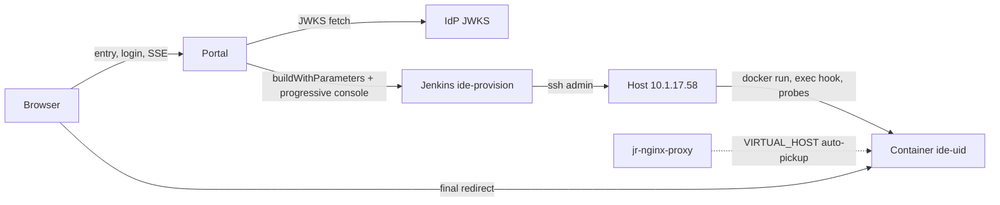

# Per-user IDE service on demand: design

English | [中文](0008-per-user-ide-design.zh.md)

Status: design draft for [0007](0007-per-user-ide-requirements.md). Requester decisions already fixed: user containers are created with `docker run` (never by editing the proxy's compose file), and Jenkins is the only executor against the Docker host.

## Overview

Three moving parts, one source of truth:



- **Portal** owns identity, the per-uid state machine, the live log, and the redirect. It holds no Docker or SSH credential.
- **Jenkins job `ide-provision`** owns every host mutation: `docker run`, the two-step start hook, and both health probes. Progress returns as console marker lines.
- **Docker host state is the truth.** The portal keeps only a marker file per uid (last Jenkins build it triggered); container existence, health, and the nginx rule are always re-read, so a portal restart or replacement loses nothing (N3).

## Portal

A small Node service deployed as one long-running container on 10.1.17.58 behind the same proxy, entry vhost `ide.jereh-pe.cn` (deployed once by hand with the same `docker run` recipe below; it is not self-provisioned). Sign-in is the shipped gate mounted unchanged: [`dsh-host-auth-iam`](../../packages/host/auth-iam/README.md) (`issuer: https://iam.jereh.cn/idp`, `clientId: EnterpriseDingtalk`; the callback `redirect_uri` is composed from the deployment's own origin — the IAM does not validate it against a registration (C10)). It owns the whole OIDC round-trip — authorize redirect, the fragment-relay callback (the IAM delivers the `id_token` in the URL fragment, so only the browser can hand it over), JWKS verification of signature/`iss`/`aud`/`exp`, and the `HttpOnly SameSite=Lax` session cookie. The cookie is host-scoped to `ide.jereh-pe.cn`, so user vhosts can never receive or read it (SR4). The portal then derives the uid from the verified token's `sub` claim, cross-checked against `userId` and `^[0-9]{1,8}$`; everything below the gate is an ordinary guarded route:

| Route | Behavior |
|---|---|
| `GET /` | No session cookie → the gate's `/login` redirect. Session → `autoCheck: true` reconciles on arrival (HEALTHY → `302` to the user IDE; otherwise render the start page, which auto-starts the run); `autoCheck: false` (the shipped default) renders the start page and nothing probes Docker until the check button POSTs `/api/provision` (FR3, FR4). |
| `GET /api/state` | Current state snapshot plus the `autoCheck` mode: state, last steps, IDE url when ready. Page bootstrap and SSE-reconnect baseline. |
| `GET /api/events` | SSE: `state` and `step` events; replays the buffered step log on connect, then streams live (FR5, N2). |
| `POST /api/provision` | Reconcile, then navigate on HEALTHY or provision (idempotent; joins an in-flight run instead of starting a second one, FR7). The check button drives it in manual mode; the auto-mode page POSTs it on bootstrap. |
| `POST /api/retry` | Re-reconcile, then retry the failed step (FR8). |

State machine transitions follow [0007](0007-per-user-ide-requirements.md). The portal is front/back separated: the start page is a static SPA built separately from the backend, every state crossing is JSON (`/api/state`, the POSTs) or SSE (`/api/events`), and the backend serves the built SPA statically without holding page logic. The portal maps state transitions onto Jenkins actions:

| Transition | Jenkins action |
|---|---|
| NO_SERVICE → PROVISIONING | `ACTION=create` |
| NO_SERVICE → STARTING (reconcile finds a stopped/frozen container) | `ACTION=start` |
| HEALTHY → UNHEALTHY | `ACTION=start` (restart with hook) |
| any → HEALTHY verification | `ACTION=probe` |

**Single flight (FR7)**: an in-process per-uid lock plus host-side idempotency. `docker run` with `--name ide-<uid>` fails on a name collision, and the job treats that collision as "already created — continue to start/probe", so even two racing Jenkins builds converge instead of forking state.

**Session lifetime**: the IAM token lives 24 h and there is no refresh path (C10), so a portal session ends at `exp`; re-navigation restarts the silent round-trip through the IAM `usk` session. A long provisioning run survives its session expiring only because the SSE stream re-reads the cookie per event: an expired session surfaces on the page as a silent re-login, and the run itself keeps going in Jenkins (the lock and marker file are session-independent).

## Model key flow (FR10, SR5)

The key has one home: the Jenkins Secret text credential `ide-model-key` in the global credentials store, maintained by whoever administers Jenkins (O3). The portal holds and sends no key: it only triggers `ACTION=create`. The path is chosen so the value never appears in an argv line, a console line, a build parameter, or a stored shell history:

1. The create-stage build binds the credential with `withCredentials([string(credentialsId: 'ide-model-key', variable: 'MODEL_KEY_SECRET')])` and fails loud when the binding is empty.
2. Inside the binding the job stages the value in a workspace file under `umask 077` and pipes that file through the ssh session's stdin to `provision.sh`, which unlinks any residue in a trap; the Jenkins `post` block wipes the staged file on every path.
3. On the host `provision.sh` writes a one-shot env file — `umask 077; printf 'NR_API_KEY=%s\n' "$KEY" > /run/ide-<uid>.env` — passes it to `docker run --env-file`, and removes it immediately after; the value reaches the daemon as file content, not as a visible argument (`docker run -e NR_API_KEY=$KEY` would expose it to every local user via `ps`).
4. The container stores the env in its own configuration, so `start`/`probe`/`stop` runs never carry the key again, and the portal page, step markers, and Jenkins console never print it.

Accepted residual risks (SR5): every user container's own shell can read the key via `docker exec`/`env`, so the key is fleet-wide, revocable, and spend-capped; Jenkins admins can read the credential store by definition. A create with an unset credential fails at the key step with a named error rather than producing a keyless container.

## Jenkins executor

One parameterized pipeline job, defined by [`Jenkinsfile.ide-provision`](../../Jenkinsfile.ide-provision) (same Pipeline-from-SCM pattern as `dsh-aio-dev-build` in [docs/ops/2026-09-05-airgapped-dsh-aio-jenkins-build.md](../ops/2026-09-05-airgapped-dsh-aio-jenkins-build.md)), all host work inside `sshagent(credentials: ['ssh'])` as `admin`; the host actions live in [`docker/ide-provision/provision.sh`](../../docker/ide-provision/provision.sh), which the job ships to `/opt/ide-provision/` on every run and executes over `ssh ... bash <path>` — by path, not `bash -s`, so the ssh stdin carries the create key from the `ide-model-key` credential binding alone (never argv, never a parameter, and never the script body itself):

| Parameter | Meaning |
|---|---|
| `UID` | Validated `^[0-9]{1,8}$`; job refuses anything else before composing a command (SR1). |
| `ACTION` | `create` / `start` / `probe` / `stop`. |
| `IMAGE_TAG` | Pinned tag (C6), e.g. `dev-amd64-<sha>`; never `latest`. |
| `REQUEST_ID` | Echoed into markers so the portal can attribute builds. |

The create-stage build additionally binds the Secret text credential `ide-model-key` (Model key flow). The Jenkins user that triggers builds needs `Credentials/Use` on the job's item scope (`Item.Build`/`Read`/`Cancel` alone makes the binding fail with "Credential 'ide-model-key' not found").

Job config: `disableConcurrentBuilds()` plus a quiet period absorbs duplicate triggers; the portal authenticates with a scoped API token for `buildWithParameters` (SR3). The job takes seconds for `probe` and minutes for `create`.

**Progress channel**: the job prints one marker per step — `[DSH_STEP] <seq> <step> <ok|fail|info> <detail>` — and the portal tails the build with Jenkins' progressive console text API, parses markers into SSE events, and maps the final build result to `READY`/`FAILED`. Poll-based tailing was chosen over the job POSTing events to the portal so Jenkins needs no route back to the portal, and the console stays the complete audit record (N2: sub-second detection, 2–3 s typical delivery).

## Provisioning recipe

`ACTION=create` on the host, values interpolated only after the uid passes SR1 (the key arrives on stdin from the `ide-model-key` credential binding, written by `provision.sh` to the env file shown here, so the key never enters this command line):

```bash
umask 077; printf 'NR_API_KEY=%s\n' "$KEY_FROM_STDIN" > /run/ide-14409.env
docker run -d --name ide-14409 \
  --hostname ide-14409 \
  --network dc_default \
  --restart unless-stopped \
  --shm-size 1g \
  --label com.jereh.uid=14409 \
  -v ide-14409-workspace:/root/workspace \
  -v ide-14409-dshome:/root/.dsh \
  --env-file /run/ide-14409.env \
  -e FRONT_PORT=8080 -e VNC_PUBLIC_URL=/vnc -e RESIZE_ENDPOINT=/resize \
  -e TRUSTED_HOSTS=ide-14409.jereh-pe.cn \
  -e VIRTUAL_HOST=ide-14409.jereh-pe.cn -e VIRTUAL_PORT=8080 \
  -e HTTPS_METHOD=noredirect -e DSH_IAM_GATE=1 \
  --entrypoint bash \
  harbor.jereh.cn/base/dsh-aio:dev-amd64 -c 'sleep 60000'
rm -f /run/ide-14409.env
```

The `--entrypoint bash -c 'sleep 60000'` override is not optional on this host (C2): the real entrypoint is then fired exactly once per start by `ACTION=start`/the create step's tail:

```bash
docker exec -d ide-14409 /usr/local/bin/entrypoint.sh >>/dev/null 2>&1
```

(The supervise-script variant from [docs/ops/2026-09-05](../ops/2026-09-05-airgapped-dsh-aio-jenkins-build.md) existed because compose could not exec; with `docker run` driven by Jenkins, the direct `docker exec -d` is the hook.)

Volumes carry all user data (FR9): `-workspace` roots `INIT_WORKSPACE`, `-dshome` keeps sessions and settings. Image stays pinned (C6); an upgrade is a `stop` + `docker rm` + `create` with a newer `IMAGE_TAG`, data untouched. Resource limits and the concurrent-user cap land here once O7 decides.

`docker-gen` inside `jr-nginx-proxy` watches the Docker socket and regenerates the vhost within seconds of the container appearing — no proxy file is ever edited (C3, C5, requester decision).

## Health check

`probe` runs on the host and must pass both levels before the portal may hand out the URL:

1. **Internal**: resolve the container IP with `docker inspect` and `curl` `http://<ip>:8080/`, accepting `200`, `302`, or `401`. Proves the entrypoint actually ran (catches C2's freeze) and front-proxy is up. The container-side gate answers `302`/`401` to the probe's unauthenticated GET, so a bare `200` is not the only live answer.
2. **Via proxy**: `curl -H 'Host: ide-<uid>.jereh-pe.cn' http://127.0.0.1/` on the host, same accepted codes. Proves docker-gen already installed the rule, so the browser will not meet a default vhost; this probe absorbs the reload delay.

Both use the pinned 8080 front-proxy port (C1). Budget: 30 s interval, 10-minute cap (C7); each attempt emits a step event with the elapsed time (FR5, N1).

## Live log

SSE event payloads are append-only JSON objects:

```json
{"type":"state","state":"STARTING","ideUrl":"http://ide-14409.jereh-pe.cn/"}
{"type":"step","seq":7,"step":"probe-proxy","status":"ok","detail":"HTTP 302 after 4 tries, 210s"}
{"type":"step","seq":8,"step":"ready","status":"ok","detail":"build #12 SUCCESS"}
```

Steps: `reconcile`, `lock`, `jenkins-queued`, `jenkins-running`, `image-pull`, `docker-run`, `start-hook`, `probe-internal`, `probe-proxy`, `ready`, `failed`. The portal buffers the current run's steps in memory and replays them on SSE (re)connect; after a portal restart the Jenkins build named in the marker file is re-attached and tailed again, so the log survives (N3).

When `ready` arrives the browser navigates via `location.href`; the page also shows a persistent "Open my IDE" button as the no-JS/popup-blocked fallback. Entry mode decides who triggers the first probe: `autoCheck: true` reconciles inside `GET /` (HEALTHY answers with the bare `302`) and the cold page auto-starts its run; `autoCheck: false` keeps the page inert until the check button. Both modes share the page, the run, and the stream (FR3, FR4).

## Container-side login (O2)

User vhosts are guessable (uid = employee number) and the proxy is HTTP-only (C4); 0005's own warning — reaching the proxy means reaching a dsh control plane — applies per user. The fix: mount the same shipped gate ([`dsh-host-auth-iam`](../../packages/host/auth-iam/README.md)) inside each user container with `clientId: EnterpriseDingtalk`; the gate builds its `redirect_uri` from the request origin, so container `ide-<uid>` signs in at `http://ide-<uid>.jereh-pe.cn/auth/callback`, and the IAM accepts that unregistered callback (C10). The overlay ships baked in the image at `/root/.dsh/iam-gate.cordis.patch.yml` and mounts through the entrypoint's `--patch` layer when `DSH_IAM_GATE=1` (always set by the provisioning script); containers launched without the switch stay open and unaffected. After the portal's redirect the browser still holds the IAM `usk` session, so the second login is a silent fragment round-trip; the verified token then lands as that container's own host-scoped cookie. The gate's own cookie model is what stores the `id_token` (SR4): the user's token lives in the user's container, nowhere else.

## Configuration

Portal config (one file, all values explicit — nothing tunable is hardcoded):

```yaml
domainSuffix: jereh-pe.cn
entryHost: ide.jereh-pe.cn
uid: {claim: sub, crossCheckClaim: userId, pattern: "^[0-9]{1,8}$"}
imageTag: dev-amd64-<sha>
jenkins: {url: https://new-jenkins.jereh.cn, job: ide-provision, user: portal, tokenEnv: IDE_JENKINS_TOKEN}
# The auth-iam gate reads its own row; jwks_uri comes from its discovery document.
# Where the server cannot reach the IAM, iam.trustFile names a JSON file
# {discovery, jwks} — the two published documents captured from any network
# that can — and the portal fetches nothing: sign-in and verification run on
# the seeded issuer/endpoints/keys. Re-capture after an IAM key rotation or
# tokens signed with new keys are refused.
iam: {issuer: https://iam.jereh.cn/idp, clientId: EnterpriseDingtalk, redirectPath: /auth/callback}
health: {intervalSec: 30, timeoutSec: 600, pollMs: 1500}
autoCheck: false                       # entry reconciles on arrival when true (0007 FR4); shipped default is the manual check button
```

The token carries no group or email claim (0007, Identity claims), so there is deliberately no `allowedGroups` here. If entry restriction is ever required it is a portal-maintained employee-number list checked after the gate, before provisioning.

## Failure modes

| Symptom | Cause | Handling |
|---|---|---|
| `docker-run` fails "name conflict" | racing build or leftover container | Treated as already-created; continue to start/probe (FR7) |
| `image-pull` fails | harbor unreachable/tag moved | `FAILED` at `image-pull`, retry re-triggers (FR8) |
| internal probe never passes | PID1 freeze — hook missed | `start` re-fires the hook once, then `TIMEOUT` with the console link (FR6, C2) |
| internal passes, proxy probe 404/502 | docker-gen reload lag, or wrong `VIRTUAL_HOST` | Keep probing within budget; on timeout `FAILED` names the nginx step |
| browser `POST /api/*` 403 on the IDE | `TRUSTED_HOSTS` mismatch (C8) | Recipe pins it from the same uid value; failure at create-time is loud |
| Jenkins queue jam | long create blocks probes | Probe uses a dedicated no-lock read path; queue position surfaces as a step event |

## Rollout and verification

1. Deploy the portal container by hand; verify the OIDC round-trip and a `probe` against the existing `dsh.jereh-pe.cn` service shape.
2. Cold-path dogfood as uid 14409: expect ≥45 s to first health answer (C7), markers streaming live, redirect landing on a working IDE after the gate's silent IAM round-trip.
3. Chaos passes: `docker stop ide-14409` → re-enter recovers via STARTING (US3); freeze the PID1 by re-creating without the hook → probe-internal catches it (FR6); two tabs at once → one build (US4).
4. Only after 1–3 pass on 10.1.17.58 revisit the parked items (O4 reclamation, O5 TLS, O7 caps) with real usage data.

## Related

- [0007](0007-per-user-ide-requirements.md) — requirements, user stories, sequence diagrams, open items.
- [0005](0005-reverse-proxy-exposure.md) — front-proxy and trust-fence constraints the recipe pins.
- [docs/ops/2026-09-05-airgapped-dsh-aio-jenkins-build.md](../ops/2026-09-05-airgapped-dsh-aio-jenkins-build.md) — Jenkins/host mechanics this design reuses.
