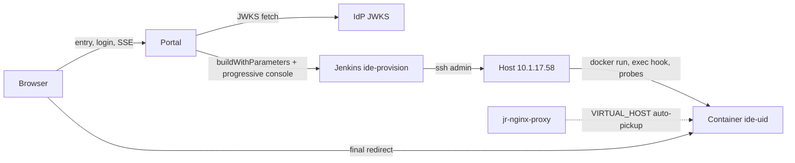

# 按需开通每用户 IDE 服务:设计

[English](0008-per-user-ide-design.md) | 中文

状态:针对 [0007](0007-per-user-ide-requirements.zh.md) 的设计草稿。需求方已拍板的决策:用户容器一律用 `docker run` 创建(绝不编辑代理的 compose 文件),Jenkins 是对 Docker 宿主机执行操作的唯一执行器。

## 总览

三个活动部件,一份事实来源:



- **Portal** 负责身份、每 uid 的状态机、实时日志与重定向。它不持有任何 Docker 或 SSH 凭据。
- **Jenkins 任务 `ide-provision`** 负责所有宿主机变更:`docker run`、两步启动 hook,以及两级健康探测。进度以 console marker 行的形式回传。
- **宿主机上的 Docker 状态是事实来源。** Portal 每个 uid 只保存一个 marker 文件(记录它最后触发的 Jenkins build);容器存在性、健康状态、nginx 规则一律重新读取,因此 Portal 重启或被替换都不丢东西(N3)。

## Portal

一个小型 Node 服务,以单个长期运行容器部署在 10.1.17.58 上、位于同一个代理之后,入口 vhost 为 `ide.jereh-pe.cn`(用下面同一套 `docker run` 配方手工部署一次,它不自举)。登录直接原样挂随附闸门:[`dsh-host-auth-iam`](../../packages/host/auth-iam/README.zh.md)(`issuer: https://iam.jereh.cn/idp`、`clientId: EnterpriseDingtalk`;回调 `redirect_uri` 按部署自身的来源拼出——IAM 不会拿它比对 client 登记(C10))。整条 OIDC 往返归它——带 state cookie 的授权重定向、fragment 中转回调(IAM 把 `id_token` 放在 URL fragment 里,只有浏览器能把它交上来)、对照 JWKS 验签名/`iss`/`aud`/`exp`、下发 `HttpOnly SameSite=Lax` 会话 cookie。该 cookie 按主机名收窄到 `ide.jereh-pe.cn`,用户 vhost 永远收不到也读不到它(SR4)。Portal 随后从已验签 token 的 `sub` claim 派生 uid,与 `userId` 交叉核对并过 `^[0-9]{1,8}$`;闸门以下的都是普通受守护路由:

| 路由 | 行为 |
|---|---|
| `GET /` | 无会话 cookie → 闸门的 `/login` 重定向。有会话 → reconcile;HEALTHY → 对用户 IDE 发 `302`;其余情况渲染启动页(FR3、FR4)。 |
| `GET /api/state` | 当前状态快照:状态、最近步骤、就绪时的 IDE url。页面 bootstrap 与 SSE 重连的基线。 |
| `GET /api/events` | SSE:`state` 与 `step` 事件;连接时先回放缓冲的步骤日志,再流式推送实时事件(FR5、N2)。 |
| `POST /api/provision` | 触发 reconcile→provision(幂等;若有进行中的开通则加入,而不是再起一个,FR7)。 |
| `POST /api/retry` | 重新 reconcile,然后重试失败的那一步(FR8)。 |

状态机的迁移遵循 [0007](0007-per-user-ide-requirements.zh.md)。Portal 前后端分离:启动页是与后端分开构建的静态 SPA,一切状态跨界都是 JSON(`/api/state`、各 POST)或 SSE(`/api/events`),后端只静态托管构建产物、不持有页面逻辑。Portal 把状态迁移映射为 Jenkins 动作:

| 迁移 | Jenkins 动作 |
|---|---|
| NO_SERVICE → PROVISIONING | `ACTION=create` |
| NO_SERVICE → STARTING(reconcile 发现已存在但未运行的容器) | `ACTION=start` |
| HEALTHY → UNHEALTHY | `ACTION=start`(带 hook 重启) |
| 任意 → HEALTHY 的验证 | `ACTION=probe` |

**单飞(FR7)**:进程内的每 uid 锁,加宿主机侧幂等。带 `--name ide-<uid>` 的 `docker run` 在重名时会失败,而任务把这种重名当作"已创建——继续到启动/探测",因此即便两个 Jenkins build 抢跑,也是收敛而不是分叉状态。

**会话寿命**:IAM token 有效期 24 小时且没有 refresh 通道(C10),因此 Portal 会话随 `exp` 终结;重新导航会经 IAM 的 `usk` 会话静默重走一遍往返。一次长时间开通能扛住会话过期,只是因为 SSE 流每个事件都重读 cookie:会话过期在页面上表现为一次静默重登,而开通本身在 Jenkins 里继续跑(锁与 marker 文件不依赖会话)。

## 模型 key 流转(FR10、SR5)

key 只有一个人工维护的家:Web 项目后端的 `.env`(`NR_API_KEY=...`,与其他机密放在一起,绝不提交)。只有 `ACTION=create` 会搬运它,路径的选择标准是:取值绝不出现在 argv 行、console 行或存留的 shell history 里:

1. Portal 在触发时刻读取 `.env`,作为掩码构建参数 `MODEL_KEY` 传给 Jenkins。
2. 任务在宿主机上写出一次性 env 文件——`umask 077; printf 'NR_API_KEY=%s\n' "$MODEL_KEY" > /run/ide-<uid>.env`——以 `docker run --env-file` 交给它,用完立刻删除;取值以文件内容(而不是可见参数)的形式到达 daemon(`docker run -e NR_API_KEY=$KEY` 会把 key 暴露给所有本地用户的 `ps`,以及进程检查)。
3. 容器把该 env 存进自身配置,`start`/`probe`/`stop` 之后都不再携带 key;Portal 页面、步骤 marker、Jenkins console 从不打印它(掩码参数覆盖 console)。

接受的残余风险(SR5):Jenkins 构建记录会持久化构建参数,因此能读 `ide-provision` 构建历史的人就能读到 key——用收紧该任务的读权限来缓解;并且每个用户容器自己的 shell 都能经 `docker exec`/`env` 读到 key,所以这把 key 是舰队级、可吊销、有消费上限的。若参数持久化将来不可接受,替代方案是预先在宿主机放好 600 权限的 env 文件(`docker/deploy-dsh-aio-arm64.sh` 已在用 `~/dsh-aio.env` 这个模式)并去掉 `MODEL_KEY`——任务配方其余部分不变。

## Jenkins 执行器

一个参数化 pipeline 任务,由 [`Jenkinsfile.ide-provision`](../../Jenkinsfile.ide-provision) 定义(与 [docs/ops/2026-09-05-airgapped-dsh-aio-jenkins-build.zh.md](../ops/2026-09-05-airgapped-dsh-aio-jenkins-build.zh.md) 里 `dsh-aio-dev-build` 同为 Pipeline from SCM 模式),所有宿主机操作都在 `sshagent(credentials: ['ssh'])` 里以 `admin` 身份执行;宿主动作全在 [`docker/ide-provision/provision.sh`](../../docker/ide-provision/provision.sh),任务每次运行都把它推到宿主 `/opt/ide-provision/`,再用 `ssh ... bash -s` 执行(create 的 key 只走 stdin,不进 argv):

| 参数 | 含义 |
|---|---|
| `UID` | 校验 `^[0-9]{1,8}$`;任务在拼装任何命令之前先拒绝其它值(SR1)。 |
| `ACTION` | `create` / `start` / `probe` / `stop`。 |
| `IMAGE_TAG` | 钉死的 tag(C6),例如 `dev-amd64-<sha>`;绝不用 `latest`。 |
| `MODEL_KEY` | `PasswordParameterDefinition`,掩码;只有 `ACTION=create` 读取它(FR10)。 |
| `REQUEST_ID` | 写入 marker,便于 Portal 把 build 归属到本次请求。 |

任务配置:`disableConcurrentBuilds()` 加静默期吸收重复触发;Portal 用限定作用域的 API token 调用 `buildWithParameters`(SR3)。`probe` 耗时数秒,`create` 耗时数分钟。

**进度通道**:任务每一步打印一行 marker——`[DSH_STEP] <seq> <step> <ok|fail|info> <detail>`——Portal 用 Jenkins 的 progressive console text API 跟踪该 build,把 marker 解析成 SSE 事件,并把最终 build 结果映射为 `READY`/`FAILED`。选择轮询式跟踪而非让任务反向 POST 给 Portal,是为了让 Jenkins 不需要通往 Portal 的回连,并且 console 本身就是完整的审计记录(N2:秒内发现,典型 2–3 秒送达)。

## 开通配方

宿主机上的 `ACTION=create`,其中的值只在 uid 通过 SR1 校验后才参与插值(env 文件即"模型 key 流转"里的 `MODEL_KEY` 文件,key 因此不进入这条命令行):

```bash
umask 077; printf 'NR_API_KEY=%s\n' "$MODEL_KEY" > /run/ide-14409.env
docker run -d --name ide-14409 \
  --hostname ide-14409 \
  --network dc_default \
  --restart unless-stopped \
  --shm-size 1g \
  --label com.jereh.uid=14409 \
  -v ide-14409-workspace:/root/workspace \
  -v ide-14409-dshome:/root/.dsh \
  --env-file /run/ide-14409.env \
  -e FRONT_PORT=8080 -e VNC_PUBLIC_URL=/vnc -e RESIZE_ENDPOINT=/resize \
  -e TRUSTED_HOSTS=ide-14409.jereh-pe.cn \
  -e VIRTUAL_HOST=ide-14409.jereh-pe.cn -e VIRTUAL_PORT=8080 \
  -e HTTPS_METHOD=noredirect \
  --entrypoint bash \
  harbor.jereh.cn/base/dsh-aio:dev-amd64 -c 'sleep 60000'
rm -f /run/ide-14409.env
```

在这台宿主机上,`--entrypoint bash -c 'sleep 60000'` 这个覆盖不是可选项(C2):真正的 entrypoint 改由 `ACTION=start`(或 create 步骤末尾)在每次启动时精确触发一次:

```bash
docker exec -d ide-14409 /usr/local/bin/entrypoint.sh >>/dev/null 2>&1
```

([docs/ops/2026-09-05](../ops/2026-09-05-airgapped-dsh-aio-jenkins-build.zh.md) 里的 supervise 脚本变体,存在的唯一原因是 compose 无法 exec;改由 Jenkins 驱动 `docker run` 之后,直接的 `docker exec -d` 就是那个 hook。)

卷承载全部用户数据(FR9):`-workspace` 挂 `INIT_WORKSPACE`,`-dshome` 保存会话与配置。镜像保持钉死(C6);升级就是 `stop` + `docker rm` + 用更新的 `IMAGE_TAG` 做一次 `create`,数据不动。资源限额与并发用户上限待 O7 定了再落在这里。

`jr-nginx-proxy` 内的 `docker-gen` 监听 Docker socket,容器出现后几秒内重新生成 vhost——全程不编辑任何代理文件(C3、C5、需求方决策)。

## 健康检查

`probe` 在宿主机上执行,两级都通过之后 Portal 才允许把 URL 交出去:

1. **内网级**:用 `docker inspect` 取容器 IP,`curl -fsS http://<ip>:8080/` → `200`。证明 entrypoint 真的跑起来了(能抓住 C2 的冻结),且 front-proxy 已就绪。
2. **经代理级**:在宿主机上 `curl -fsS -H 'Host: ide-<uid>.jereh-pe.cn' http://127.0.0.1/` → `200`。证明 docker-gen 已经装好规则,浏览器不会撞上默认 vhost;这一级同时吸收 nginx 重载延迟。

两级都打向钉死的 8080 front-proxy 端口(C1)。预算:30 秒一次,上限 10 分钟(C7);每次尝试都发一条带已耗时的事件(FR5、N1)。

## 实时日志

SSE 事件负载是只追加的 JSON 对象:

```json
{"type":"state","state":"STARTING","ideUrl":"http://ide-14409.jereh-pe.cn/"}
{"type":"step","seq":7,"step":"probe-proxy","status":"ok","detail":"200 after 4 tries, 210s"}
{"type":"step","seq":8,"step":"ready","status":"ok","detail":"build #12 SUCCESS"}
```

步骤:`reconcile`、`lock`、`jenkins-queued`、`jenkins-running`、`image-pull`、`docker-run`、`start-hook`、`probe-internal`、`probe-proxy`、`ready`、`failed`。Portal 在内存中缓冲本轮步骤,并在 SSE (重)连时回放;Portal 重启后,按 marker 文件里记录的 build 重新挂上并继续跟踪,因此日志能存活(N3)。

收到 `ready` 时浏览器用 `location.href` 跳转;页面同时常驻一个"进入我的 IDE"按钮,作为无 JS/弹窗被拦截时的兜底。热路径根本不打开 SSE 流——它就是一条裸 `302`(FR3)。

## 容器侧登录(建议,对应 O2)

用户 vhost 可被枚举(uid 即工号),且代理仅 HTTP(C4);0005 自己那句警告——能碰到代理就等于碰到 dsh 控制平面——现在要按每个用户来算。建议:在每个用户容器内挂同一个随附闸门([`dsh-host-auth-iam`](../../packages/host/auth-iam/README.zh.md)),`clientId: EnterpriseDingtalk`;闸门按请求来源拼自己的 `redirect_uri`,容器 `ide-<uid>` 的登录回调就是 `http://ide-<uid>.jereh-pe.cn/auth/callback`,IAM 接受这个未登记的回调(C10)——挂闸门就是镜像里一行 cordis.yml 加 IAM client 配置,零逐用户协调。Portal 跳转过去时浏览器仍持有 IAM 的 `usk` 会话,于是第二次登录只是一次静默 fragment 往返;随后已验签 token 落为该容器自己的、按主机名收窄的 cookie。闸门自身的 cookie 模型就是会存 `id_token`(SR4):用户的 token 只存在于用户自己的容器里,别无他处。在 O2 落地之前,把每个用户 vhost 都当作一台开放的内部测试机看待。

## 配置

Portal 配置(单文件,所有取值显式——任何可调项都不硬编码):

```yaml
domainSuffix: jereh-pe.cn
entryHost: ide.jereh-pe.cn
uid: {claim: sub, crossCheckClaim: userId, pattern: "^[0-9]{1,8}$"}
imageTag: dev-amd64-<sha>
modelKey: {envFile: .env, varName: NR_API_KEY}   # read at create only (FR10, SR5)
jenkins: {url: https://new-jenkins.jereh.cn, job: ide-provision, user: portal, tokenEnv: IDE_JENKINS_TOKEN}
# The auth-iam gate reads its own row; jwks_uri comes from its discovery document.
iam: {issuer: https://iam.jereh.cn/idp, clientId: EnterpriseDingtalk, redirectPath: /auth/callback}
health: {intervalSec: 30, timeoutSec: 600, pollMs: 1500}
```

token 不携带 group 或 email claim(0007"身份 claim"),所以这里刻意没有 `allowedGroups`。将来确需限制进入时,是闸门之后、开通之前,由 Portal 侧维护一份工号名单来核查。

## 失败模式

| 症状 | 原因 | 处理 |
|---|---|---|
| `docker-run` 报 "name conflict" | 抢跑的 build 或残留容器 | 视为已创建;继续走 start/probe(FR7) |
| `image-pull` 失败 | harbor 不可达 / tag 已移动 | 在 `image-pull` 处 `FAILED`,重试重新触发(FR8) |
| 内网探测始终不过 | PID1 冻结——漏发 hook | `start` 补发一次 hook,随后 `TIMEOUT` 并附 console 链接(FR6、C2) |
| 内网过、经代理 404/502 | docker-gen 重载延迟,或 `VIRTUAL_HOST` 写错 | 在预算内持续探测;超时则 `FAILED` 并点名 nginx 这一步 |
| 浏览器在 IDE 上 `POST /api/*` 得 403 | `TRUSTED_HOSTS` 不匹配(C8) | 配方从同一个 uid 值派生它;创建期失败是响的 |
| Jenkins 队列堵塞 | 长时间 create 挡住 probe | probe 走专用的无锁只读路径;队列位次作为一种步骤事件呈现 |

## 落地与验证

1. 手工部署 Portal 容器;验证 OIDC 往返,并对现有 `dsh.jereh-pe.cn` 服务形态跑一次 `probe`。
2. 以 uid 14409 做冷路径自用:预期首个 200 至少 45 秒(C7),marker 实时成流,跳转落在一个可用的 IDE 上。
3. 扰动验证:`docker stop ide-14409` → 再进入应经 STARTING 恢复(US3);创建时故意不发 hook 以复现 PID1 冻结 → probe-internal 能抓住(FR6);同时开两个标签页 → 只有一个 build(US4)。
4. 只有在 10.1.17.58 上第 1–3 步都通过后,再凭真实使用数据回头评估已搁置项(O2 登录、O4 闲置回收、O5 TLS、O7 封顶)。

## 相关

- [0007](0007-per-user-ide-requirements.zh.md) —— 需求、用户故事、时序图、未决事项。
- [0005](0005-reverse-proxy-exposure.zh.md) —— 配方所钉住的那些 front-proxy 与信任栅栏约束。
- [docs/ops/2026-09-05-airgapped-dsh-aio-jenkins-build.zh.md](../ops/2026-09-05-airgapped-dsh-aio-jenkins-build.zh.md) —— 本设计复用的 Jenkins/宿主机机制。
