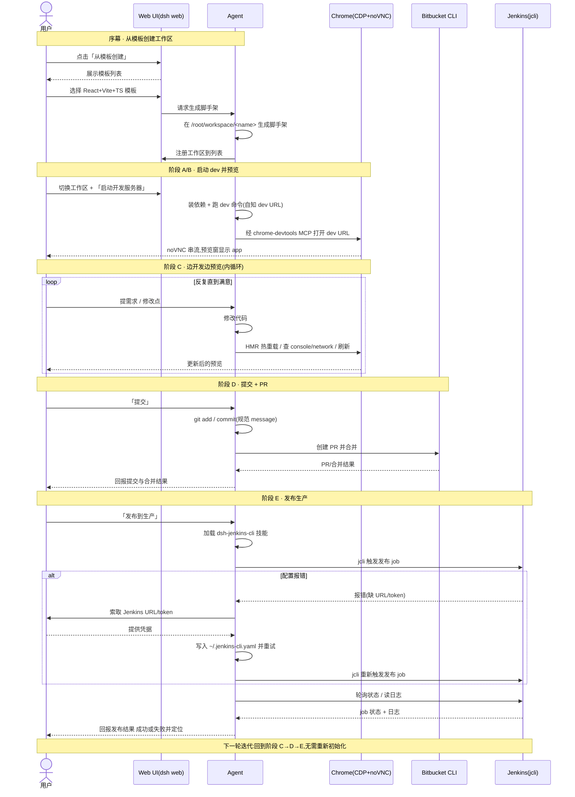

# PRD:Web App 工作区「开发 → 预览 → 提交 → 发布」闭环

状态:草案(draft / proposed)

## 一句话摘要

在 dsh-aio 一体化镜像里,让用户从**模板**创建一个 Web App 工作区,由 **Agent** 自行启动 dev 服务器并在容器内 **Chrome** 打开预览(经 noVNC 串流到浏览器),用户与 Agent 边开发边预览;满意后通过 **Bitbucket CLI** 提交并创建 PR、合并,再由用户下达指令让 Agent 加载 **Jenkins 技能**、用 **jcli** 触发发布 job 并回报结果,如此循环进入下一轮迭代。

---

## 1. 背景与目标

### 1.1 产品背景

DeepSeek Harness 提供 **dsh-aio** 一体化镜像:一个容器里同时运行以下服务,构成一个「浏览器里即可完成的 agent 协作开发环境」。

| 组件 | 端口 | 作用 |
|---|---|---|
| dsh web | 3080 | Agent 聊天式 Web IDE,承载会话/工作区管理 |
| 真实 Chrome(CDP) | 9222 | 跑在虚拟显示器上的真实浏览器,通过 Chrome DevTools Protocol 被驱动 |
| Xvnc + noVNC | 6080 | 把 Chrome 画面串流到用户浏览器标签页,用户可直接看到 |
| chrome-devtools MCP | 不适用 | 已作为 `mcp__chrome__*` 工具桥接进 dsh,Agent 借此驱动 Chrome(导航、查 console/network、刷新等) |

用户全程在浏览器里通过 Web 与 Agent 协作。整个 `/root` 由命名卷持久化,用户配置、代码与会话不随镜像升级丢失。

### 1.2 要解决什么

当前用户若想在 dsh-aio 里从零做一个 Web App,并把它一路推到生产,缺少一条被产品明确定义、端到端串起来的路径:

- 没有现成的**工作区模板机制**,新项目需要手工搭脚手架;
- 「启动 dev → 在容器内 Chrome 预览」的动作虽然技术上可行(chrome-devtools MCP 已就绪),但没有被规范成一个可复用的产品流程;
- 代码提交、创建 PR、合并、发布到生产各自割裂,缺少「一轮迭代」的闭环定义。

本 PRD 定义这条端到端闭环,并明确其中**哪些能力已就绪、哪些是待建的新需求**。

### 1.3 目标(面向谁)

- **面向用户**:非必须记忆命令行细节的开发者,期望在浏览器里通过自然语言与 Agent 协作,快速完成「建项目 → 开发预览 → 提交 → 发布」。
- **面向产品/工程**:把一体化镜像里既有的能力(会话/工作区、Chrome 预览、Jenkins 技能)串成明确、可验收的用户旅程,并划定新增能力(模板机制、Bitbucket CLI 集成)的范围。

---

## 2. 名词与角色定义

| 角色 / 名词 | 说明 |
|---|---|
| **用户** | 在浏览器里使用 dsh web 的人,下达自然语言指令、查看预览、决定何时提交与发布 |
| **Web UI(dsh web)** | 端口 3080 的 agent 聊天式 Web IDE,提供会话与工作区管理界面 |
| **Agent** | dsh web 背后的 AI 助手,执行脚手架生成、装依赖、启动 dev、驱动 Chrome、git 操作、调用 Bitbucket/Jenkins CLI |
| **Chrome(CDP+noVNC)** | 容器内真实浏览器;Agent 经 CDP / chrome-devtools MCP 驱动,画面经 noVNC 串流给用户预览 |
| **Bitbucket CLI** | 用于创建 PR 并合并的命令行工具(**待建/待集成**,见第 8 节) |
| **Jenkins / jcli** | Jenkins 命令行客户端(jenkins-zh 的 `jcli`),Agent 借助 **dsh-jenkins-cli 技能**触发发布 job、查状态、读日志 |
| **模板** | 用于快速创建工作区的项目脚手架;初期只有一个:React + Vite + TypeScript(**待建**,见第 8 节) |
| **工作区(workspace)** | 位于 `/root/workspace/<name>` 的项目目录,注册在 dsh web 的工作区列表中 |

---

## 3. 核心用户故事

> 格式:作为 <角色>,我想 <目标>,以便 <价值>。

### US-1 从模板创建工作区
作为**用户**,我想在会话管理界面「从模板创建」一个 React + Vite + TypeScript 工作区,以便无需手工搭脚手架就能开始一个新 Web App。

### US-2 切换工作区并让 Agent 启动 dev
作为**用户**,我想切换到该工作区并让 Agent「启动开发服务器」,以便由 Agent 自动装依赖、跑 dev 命令,而不必自己敲命令或提供 dev 地址。

### US-3 在 Chrome 中预览
作为**用户**,我想让 Agent 用它自己最清楚的 dev URL 在容器内 Chrome 打开应用,以便通过 noVNC 在浏览器里实时看到运行效果。

### US-4 边开发边预览(内循环)
作为**用户**,我想用自然语言提需求、看 Agent 改代码后经 HMR 热重载的即时效果,以便快速迭代直到满意。

### US-5 提交并用 Bitbucket CLI 建 PR 合并
作为**用户**,我想在满意后让 Agent 用规范的 message 提交,并通过 Bitbucket CLI 创建 PR 并合并,以便把变更规范地纳入主线。

### US-6 用户指令触发 Jenkins 发布并获取结果
作为**用户**,我想下达「发布到生产」指令,让 Agent 加载 Jenkins 技能、用 jcli 触发发布 job 并回报成功/失败结果,以便可控地把变更发布到生产环境。

### US-7 下一轮迭代
作为**用户**,我想在一轮闭环完成后直接进入下一轮「开发预览 → 提交发布」,以便复用已就绪的工作区、dev server、Chrome 预览与 Jenkins 配置,无需重新初始化。

---

## 4. 端到端事件时序

角色:**用户** / **Web UI(dsh web)** / **Agent** / **Chrome(CDP+noVNC)** / **Bitbucket CLI** / **Jenkins(jcli)**。

### 4.1 分阶段步骤

**序幕 · 从模板创建工作区**
1. 用户在会话管理界面点击「从模板创建」。
2. Web UI 展示可用模板;用户选择 **React + Vite + TypeScript** 模板。
3. Agent 在 `/root/workspace/<name>` 生成脚手架(项目骨架、`package.json`、Vite/TS 配置等)。
4. Agent 将新工作区注册到 dsh web 的工作区列表。

**阶段 A · 切换 + 启动 dev**
5. 用户切换到该工作区,并下达「启动开发服务器」。
6. Agent 安装依赖(如 `pnpm install`)。
7. Agent 运行 dev 命令(如 `pnpm dev`)。
8. 由于 dev 由 Agent 自己启动,Agent 自知 dev URL(例如 `http://localhost:5173`),无需用户提供地址。

**阶段 B · Chrome 预览**
9. Agent 通过 chrome-devtools MCP(`mcp__chrome__*`)让容器内 Chrome 打开该 dev URL。
10. Chrome 加载页面;noVNC 将画面串流到用户浏览器标签页。
11. 用户在预览窗看到运行中的 app。

**阶段 C · 边开发边预览(内循环,可反复)**
12. 用户用自然语言提出需求或修改点。
13. Agent 修改代码。
14. Vite dev server 触发 HMR 热重载,页面即时更新。
15. Agent 必要时用 CDP 查 console/network、刷新页面以自查。
16. 用户查看效果;不满意则回到步骤 12 继续,满意则进入阶段 D。

**阶段 D · 提交 + PR**
17. 用户下达「提交」。
18. Agent 执行 `git add` / `git commit`(规范的提交信息)。
19. Agent 用 **Bitbucket CLI** 创建 PR 并合并。
20. Agent 回报提交与 PR/合并结果。

**阶段 E · 发布生产**
21. 用户下达「发布到生产」指令。
22. Agent 加载 **dsh-jenkins-cli** 技能。
23. Agent 用 **jcli** 触发发布 job。
    - 若配置报错,走技能内置的**运行时纠错闭环**:向用户索取 Jenkins URL / token → 写入 `~/.jenkins-cli.yaml` → 重试。
24. Agent 用 jcli 轮询 job 状态、读取日志。
25. Agent 回报发布结果(成功;或失败并读日志尾部定位问题)。

**下一轮迭代**
26. 回到阶段 C → D → E。工作区、dev server、Chrome 预览、Jenkins 配置均已就绪,无需重新初始化。

### 4.2 时序图

---

## 5. 验收标准

以 Given / When / Then 描述,每条对应第 3 节的用户故事。

### AC-1(对应 US-1)从模板创建工作区
- Given 用户在会话管理界面,且模板列表包含 React + Vite + TypeScript;
- When 用户选择该模板并确认创建;
- Then 在 `/root/workspace/<name>` 生成可运行的 React+Vite+TS 脚手架,且该工作区出现在工作区列表中。

### AC-2(对应 US-2)Agent 启动 dev
- Given 用户已切换到该工作区;
- When 用户下达「启动开发服务器」;
- Then Agent 自动安装依赖并运行 dev 命令,dev server 成功监听,且**无需用户提供 dev 地址**。

### AC-3(对应 US-3)Chrome 预览
- Given dev server 已就绪;
- When Agent 用自知的 dev URL 通过 chrome-devtools MCP 打开;
- Then 容器内 Chrome 加载该 URL,用户经 noVNC 在预览窗看到运行中的 app。

### AC-4(对应 US-4)内循环开发预览
- Given 预览窗正显示 app;
- When 用户提出需求、Agent 修改代码;
- Then dev server 触发 HMR,预览在无需手工重启的情况下即时更新;必要时 Agent 能通过 CDP 读取 console/network 并刷新自查。

### AC-5(对应 US-5)提交 + Bitbucket PR 合并
- Given 用户对当前效果满意;
- When 用户下达「提交」;
- Then Agent 以规范 message 完成 `git commit`,并用 **Bitbucket CLI** 创建 PR 且完成合并,随后向用户回报结果。

### AC-6(对应 US-6)Jenkins 发布并获取结果
- Given 用户下达「发布到生产」;
- When Agent 加载 dsh-jenkins-cli 技能并用 jcli 触发发布 job;
- Then Agent 能轮询 job 状态与日志,并回报明确结果(成功;或失败并读日志尾部定位问题);
- And 若因缺少 URL/token 报错,Agent 能走技能的纠错闭环(向用户索取 → 写入 `~/.jenkins-cli.yaml` → 重试)。

### AC-7(对应 US-7)下一轮迭代
- Given 上一轮「开发→预览→提交→发布」已完成;
- When 用户开始新一轮需求;
- Then 工作区、dev server、Chrome 预览与 Jenkins 配置均可直接复用,无需重新初始化即可进入阶段 C→D→E。

---

## 6. 非功能需求

- **持久化**:工作区代码、用户配置、会话与 `~/.jenkins-cli.yaml` 等均位于 `/root`,由命名卷持久化,不随镜像升级丢失。
- **安全 / 凭据管理**:不硬编码任何 Jenkins / Bitbucket 的地址、token、仓库名或主机名;凭据在**运行时**由用户提供并写入用户目录下的配置文件,不烘焙进镜像层。
- **单一 Web 入口**:用户全程通过浏览器里的 dsh web(3080)与预览(noVNC 6080)完成操作,不要求本机安装额外工具。
- **可观测性**:发布失败时 Agent 应读取 job 日志尾部并向用户给出可定位的失败原因。
- **一致性**:提交信息遵循项目既有的规范(类型前缀 + 简洁描述)。

---

## 7. 能力现状:已就绪 vs 待建

> 本 PRD 严格区分「已就绪」与「待建」,避免把愿景写成已实现。

### 7.1 已就绪
- dsh web 的会话 / 工作区管理。
- 真实 Chrome + noVNC 预览。
- chrome-devtools MCP(`mcp__chrome__*`)驱动 Chrome。
- **dsh-jenkins-cli 技能**:教 Agent 用 jenkins-zh 的 `jcli` 触发构建、看日志、查状态,并含「调用报错 → 向用户要 URL/token → 写入 `~/.jenkins-cli.yaml` → 重试」的运行时纠错闭环。
- `jcli` 已装进 dsh-aio 镜像。

### 7.2 待建(本 PRD 提出的新需求)
- **① 工作区模板机制**:React + Vite + TypeScript 的模板创建能力。当前项目**没有现成的模板机制**,需要新建。
- **② Bitbucket CLI 集成**:用于「创建 PR 并合并」。注意项目当前使用的是 **GitHub CLI**、仓库托管在 **GitHub**;**Bitbucket CLI 是尚未存在的能力**,需新增集成。

---

## 8. 依赖与待建项

| 项 | 状态 | 说明 |
|---|---|---|
| dsh web 会话/工作区管理 | 已就绪 | 承载序幕与阶段 A 的界面交互 |
| Chrome + noVNC + chrome-devtools MCP | 已就绪 | 支撑阶段 B/C 的预览与自查 |
| dsh-jenkins-cli 技能 + jcli | 已就绪 | 支撑阶段 E 的发布与结果回报 |
| **React+Vite+TS 模板机制** | **待建** | 序幕的前置依赖;初期只有此一个模板 |
| **Bitbucket CLI 集成** | **待建/待集成** | 阶段 D 的前置依赖;当前项目用 GitHub CLI、仓库在 GitHub |

---

## 9. 超出范围 / 后续(Future)

以下不在本 PRD 范围内,留作后续迭代:

- **多模板**:除 React+Vite+TS 外的其他技术栈模板(如 Vue、Next.js、纯静态站点等)。
- **回滚**:发布失败或生产异常时的一键回滚机制。
- **多环境**:除生产外的 staging / 预发等多套发布环境与晋级流程。
- **模板参数化**:创建工作区时的可配置选项(命名规范、依赖预选、lint/format 预设等)。
- **CI 门禁**:PR 合并前的自动化测试 / 检查门禁与状态回显。
